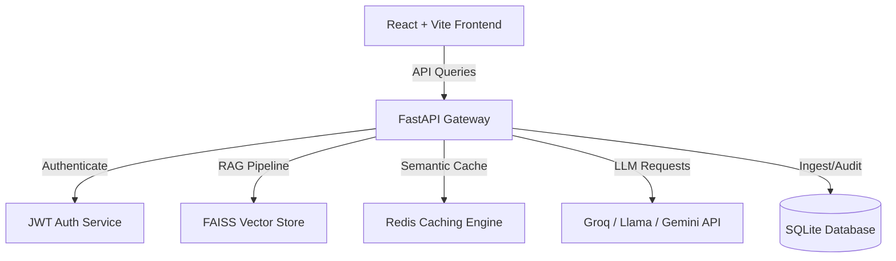

# Enterprise AI Document Assistant 🚀

[](https://github.com/viswateja5/enterprise-ai-document-assistant/actions/workflows/ci-cd.yml)
[](https://fastapi.tiangolo.com)
[](https://react.dev)
[](https://vite.dev)
[](https://sqlite.org)
[](https://tailwindcss.com)

Enterprise AI Document Assistant (DocAssistant AI) is a production-ready, secure, and responsive web application designed to scan, chunk, index, and query enterprise documents in real time. Powered by **Retrieval-Augmented Generation (RAG)**, it combines vector search (FAISS) with high-performance LLMs to deliver immediate, cited answers.

---

## ⚡ Features

### 1. Unified Chat Workspace
* **Real-time Streaming**: Token-by-token generation with interactive loading states ("Thinking...", "Searching documents...", "Generating answer...").
* **Optimistic UI Updates**: Instant message dispatch and display.
* **Auto-Scrolling**: Automatically scrolls to the newest message during ingestion/generation.
* **Code Sandbox**: Formatted code blocks with internal scroll bounds and copy utilities.

### 2. Interactive Study Center
* **Material Compilation**: Instantly generates Multiple Choice Questions (MCQs), Flashcards, and Interview Guides.
* **Scroll-Bound Cards**: Sliced lists with interactive "Show More" buttons.
* **3D Recall Cards**: Flip cards in 3D to reveal definitions and test memory.
* **Progress Tracking**: Persists statistics (accuracy, cards flipped, quizzes taken) directly.

### 3. GraphRAG Relationship Explorer
* **Entity Link Mapper**: Visually trace the shortest relationship pathways between extracted concepts.

### 4. Admin Monitoring Console
* **Role-Based Routing**: Strict access validation on `/admin` routes. Regular users are safely redirected to `/dashboard` with warning alerts.
* **Interactive Charting**: Custom SVG latency trend charts showing rolling average response times.
* **Live System Status**: Monitors SQLite/FAISS vectors, Redis cache hit ratio, and API diagnostics.

---

## 📐 Architecture Overview



---

## 🛠️ Tech Stack

* **Frontend**: React 19, Vite, TailwindCSS, Framer Motion, Lucide Icons.
* **Backend**: FastAPI, SQLAlchemy (async), Uvicorn, SQLite/Aiosqlite, Redis.
* **AI/RAG**: FAISS (vector DB), HuggingFace Embeddings, LangChain, Tavily API.
* **DevOps**: Docker, Docker Compose, GitHub Actions.

---

## 🚀 Installation & Setup

### Prerequisites
* Python 3.11+
* Node.js 20+
* Redis Server (optional, for caching)

### Backend Configuration
1. Navigate to the backend directory:
   ```bash
   cd backend
   ```
2. Create virtual environment and activate it:
   ```bash
   python -m venv venv
   source venv/bin/activate
   ```
3. Install dependencies:
   ```bash
   pip install -r requirements.txt
   ```
4. Configure environment variables (copy `.env.example` to `.env`):
   ```bash
   cp .env.example .env
   ```
5. Launch the backend server:
   ```bash
   PYTHONPATH=. uvicorn app:app --port 8000 --reload
   ```

### Frontend Configuration
1. Navigate to the frontend directory:
   ```bash
   cd ../frontend
   ```
2. Install npm modules:
   ```bash
   npm install --legacy-peer-deps
   ```
3. Configure environment variables (copy `.env.example` to `.env`):
   ```bash
   cp .env.example .env
   ```
4. Start the Vite development server:
   ```bash
   npm run dev
   ```

---

## ⚙️ Environment Variables

### Backend Configuration (.env)
| Variable | Description | Default |
| :--- | :--- | :--- |
| `MODEL_PROVIDER` | Active LLM endpoint provider (`groq`, `openai`, `gemini`, `ollama`) | `groq` |
| `GROQ_API_KEY` | Groq console authorization API credentials | - |
| `TAVILY_API_KEY` | Search API credentials for web research fallbacks | - |
| `JWT_SECRET_KEY` | Random SHA256 secret key for signing session tokens | - |
| `DATABASE_URL` | SQLAlchemy connector string | `sqlite+aiosqlite:///vector_store/chat_history.db` |
| `REDIS_URL` | Redis caching connection URL | `redis://localhost:6379/0` |

### Frontend Configuration (.env)
| Variable | Description | Default |
| :--- | :--- | :--- |
| `VITE_API_URL` | Target FastAPI backend gateway endpoint | `http://localhost:8000` |

---

## 🐳 Running with Docker

Run the entire suite (FastAPI, React, SQLite, Redis) using Docker Compose:
```bash
docker-compose up --build
```
The application will be accessible at `http://localhost:3000/`.

---

## 🧪 Testing

Run pytest suite locally inside the `backend` folder:
```bash
PYTHONPATH=. venv/bin/pytest tests/
```

---

## 🌟 Future Enhancements

* **Workspace Virtualization**: Lazy rendering for infinite chat scrolls.
* **Hybrid Cloud Vector Indexes**: Synced FAISS to PgVector.
* **Ollama Offline Models**: Seamless local CPU processing support.
